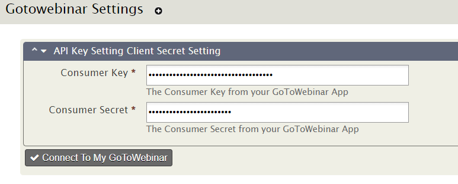

# GoToWebinar Integration for CiviCRM Events #

### Overview ###

CiviCRM Events can be integrated with GoToWebinar.

### Installation ###

* Install the extension in CiviCRM. More details [here](https://docs.civicrm.org/sysadmin/en/latest/customize/extensions/#installing-a-new-extension) about installing extensions in CiviCRM.
* Configure GoToWebinar details in **Events >> GoToWebinar Settings** (civicrm/gotowebinar/settings?reset=1)

* Create an "app" on the GoToWebinar apps page. Setup Redirect URL : [https://yourwebsite.com]/civicrm/gotowebinar/settings. (replace yourwebsite.com with your website domain)
* Copy the **Client Key** and **Consumer Secret** into the settings page in CiviCRM.
* You will also need to use the username and password to log into the GoToWebinar website. The username and password will not be saved in CiviCRM.
* The authentication will get refreshed occassionally. It will attempt to reauthenticate when trying to fetch webinar information on event pages and on the settings page. If you see a notice that GoToWebinar is disconnected, first try to refresh the settings page. If that doesn't work you may need to provide your username and password again. That should be rare.
* After a successful authentication, a list of upcoming webinars will be fetched and displayed on the screen. (Note: first name, last name & email are the only fields that get pushed to the webinar for now. Webinars with additional mandatory fields will not get participants added from CiviCRM.)

### Usage ###

* Set up a CiviCRM Event with a Webinar Key

* When participants register for that CiviCRM Event, they are automatically created for the GoToWebinar event as well.

### Changelog ###

#### Ver 3.0.4 ####
* Migrated to New OAuth v2 Proxy API
* Fixed dedprecated warning during set/get setting values

#### Ver 3.0.1 ####
* Updated Installations instructions from FreeForms fork 
* Changed labels on settings screen to mirror GoToWebinar as per FreeForms fork

#### Ver 3.0.0 ####
* Migrated to a new Webinar API which uses OAuthv2 standard
* Auto refresh to obtain new access token and refresh token

#### Ver 2.0.0 ####
* Migrated to new Webinar API.
* Re-authenticate when the access token become invalid/expired.
* Display a warning if a webinar has additional mandatory fields.
* Display failure messages on thank you page if pushing the participant to the webinar failed.

### Support ###

support@vedaconsulting.co.uk
